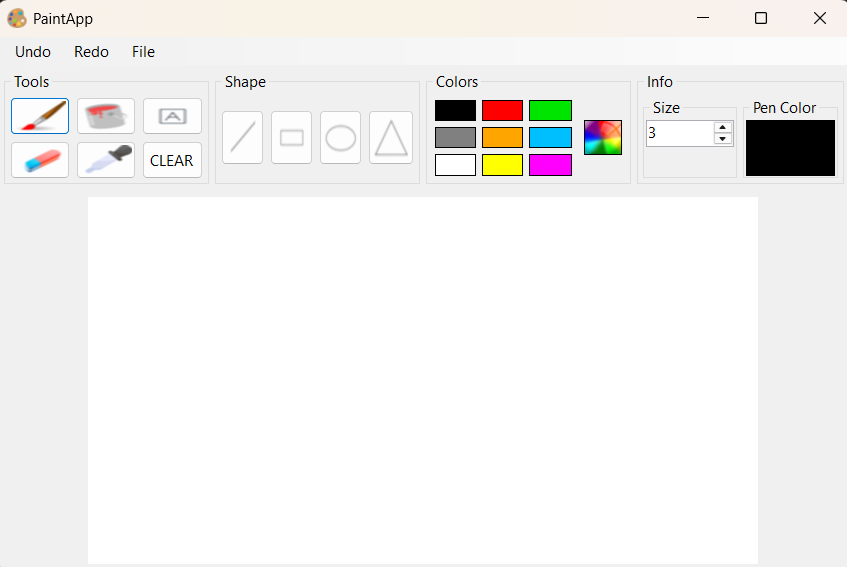
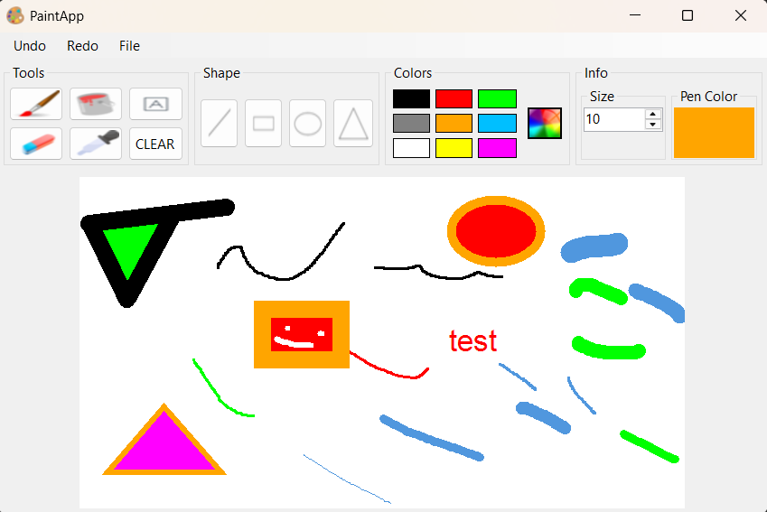
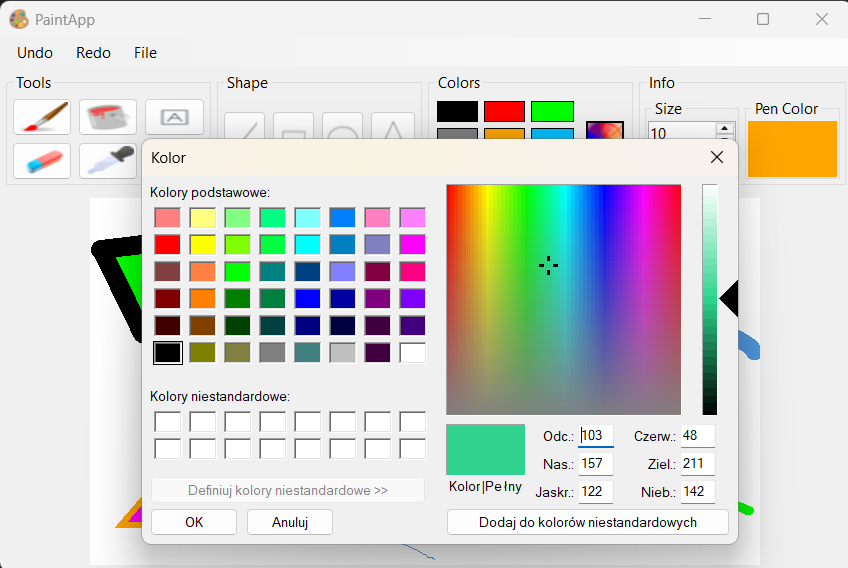

# PaintApp

PaintApp to prosta aplikacja Windows Forms przeznaczona do rysowania, edycji i tworzenia grafiki. Umożliwia użytkownikowi swobodne szkicowanie, malowanie oraz dodawanie kształtów i tekstu na cyfrowym płótnie. Program pozwala na zapisywanie i wczytywanie plików graficznych, dzięki czemu można kontynuować pracę nad obrazem w dowolnym momencie. Intuicyjny interfejs zrobiony na wzór orginalnej aplikacji Paint.

## Zdjęcia

## Funkcje

- narzędzia rysowania takie jak: Pędzel, Gumka, Wypełnienie, Tekst, Pipeta, Linia, Prostokąt, Elipsa, Trójkąt
- Szybki wybór koloru z palety lub pipetą
- Zmiana rozmiaru narzędzia (NumericUpDown)
- Historia zmian: Cofnij/Ponów (Undo/Redo)
- Czyszczenie obrazu (CLEAR)
- Otwieranie i zapisywanie plików graficznych
- Intuicyjny interfejs z podziałem na panele narzędzi, kształtów, kolorów i ustawień

## Struktura projektu

| Plik | Opis |
|------|------|
| `PaintApp/Form1.cs` | Logika interfejsu, obsługa zdarzeń, rysowanie, menu, historia zmian. |
| `PaintApp/ToolManager.cs` | Zarządzanie aktualnym narzędziem, kolorem i rozmiarem. |
| `PaintApp/HistoryManager.cs` | Obsługa historii zmian obrazu (undo/redo). |
| `PaintApp/ITool.cs` | Interfejs narzędzi rysujących. |
| `PaintApp/BrushTool.cs` | Implementacja pędzla. |
| `PaintApp/FillTool.cs` | Implementacja narzędzia wypełnienia. |
| `PaintApp/TextTool.cs` | Dodawanie tekstu na obrazie. |
| `PaintApp/ColorPickerTool.cs` | Pipeta do pobierania koloru z obrazu. |
| `PaintApp/LineTool.cs` | Rysowanie linii. |
| `PaintApp/RectangleTool.cs` | Rysowanie prostokątów. |
| `PaintApp/EllipseTool.cs` | Rysowanie elips. |
| `PaintApp/TriangleTool.cs` | Rysowanie trójkątów. |
| `PaintApp/ShapeTool.cs` | Klasa bazowa dla narzędzi kształtów. |
| `PaintApp/Tools.cs` | Enum z nazwami narzędzi. |

